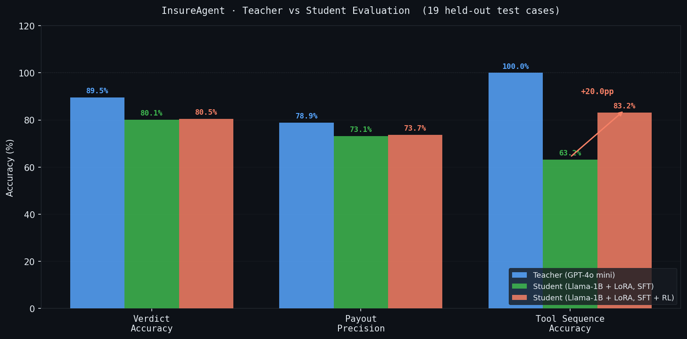
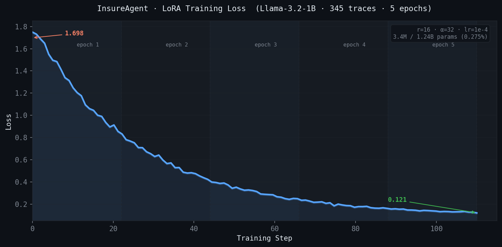
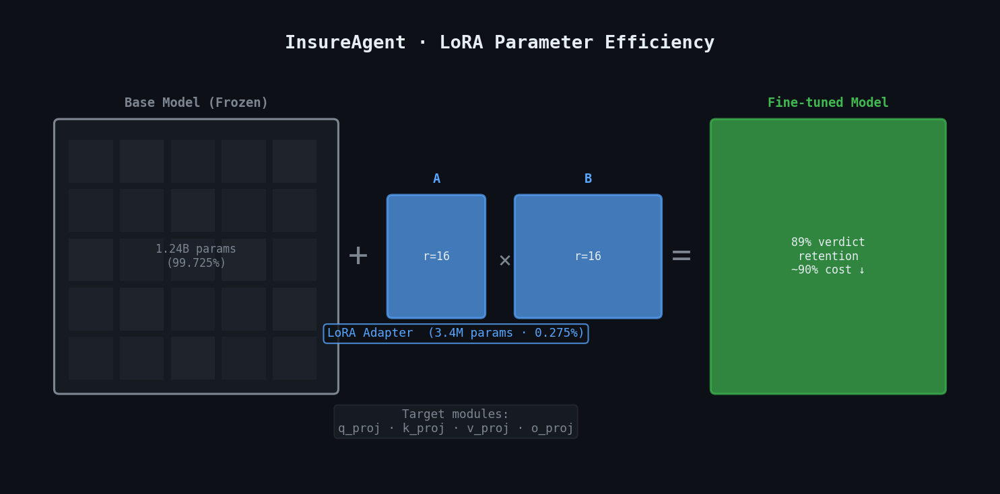

# InsureAgent

> Distilling Agentic Reasoning into Compact LLMs for Regulated Environments

InsureAgent demonstrates how to distil agentic reasoning from a large teacher model (GPT-4o mini) into a compact student model (Llama-3.2-1B + LoRA) for insurance claims processing. The student model runs fully locally, addressing data sovereignty requirements in regulated industries.

[](https://github.com/yuan-phd/insureagent/actions/workflows/ci.yml)
&nbsp;
[](https://huggingface.co/yuanphd/insureagent-lora-v2)
&nbsp;
[](https://insureagent.streamlit.app)

**Streamlit Cloud (live demo)**  
→ https://insureagent.streamlit.app/  
Runs Teacher model directly via OpenAI API.

---

## Evaluation Results

Evaluated on 19 held-out test cases covering approvals, denials (not covered, policy inactive, claim limit), and edge cases (below deductible, exceeds annual cap).



The student model runs fully locally on a single GPU, reducing inference cost by ~90% compared to the teacher API.

---

## Engineering Stack

| Layer | Technology |
|---|---|
| Inference API | FastAPI + Pydantic (as parser) |
| Containerisation | Docker + docker-compose |
| Kubernetes | minikube · kubectl · NodePort service |
| Fine-tuning | TRL + PEFT (LoRA), Google Colab T4 |
| RL post-training | GRPO (TRL GRPOTrainer), verifiable reward |
| NLP pre-filter | Zero-shot risk classifier (DeBERTa-v3-small) |
| Data versioning | Databricks Unity Catalog (Delta Lake) |
| Experiment tracking | MLflow (local + Databricks) |
| Data validation | Pandera schema checks |
| Monitoring | EvidentlyAI offline drift detection |
| Load testing | Locust (5 concurrent users, 0.3 RPS) |
| Logging | structlog (JSON in production) |
| CI/CD | GitHub Actions |

| Parameter | Value |
|---|---|
| Base model | meta-llama/Llama-3.2-1B-Instruct |
| LoRA rank (r) | 16 |
| LoRA alpha | 32 |
| Attention modules | q_proj, k_proj, v_proj, o_proj |
| Trainable parameters | 3.4M / 1.24B (0.275%) |
| Training data | 345 traces |
| Epochs | 5 |
| Learning rate | from 2e-4 to 1e-4 |
| Loss (start → end) | 1.698 → 0.121 |



The trained adapter is available at: [yuanphd/insureagent-lora-v2](https://huggingface.co/yuanphd/insureagent-lora-v2)


---

## Load Test Results

Tested with Locust, 5 concurrent users, Teacher model (GPT-4o mini).

| Metric | Value |
|---|---|
| RPS | 0.3 |
| Median latency | 6,000ms |
| P95 latency | 52,000ms |
| Failure rate | 22% |

Failures are caused by OpenAI API timeout under concurrent load — each claim requires 3 sequential API calls. Student model inference eliminates this bottleneck by running fully locally. Full results: [`evaluation/locust_results.md`](evaluation/locust_results.md)

---

## Architecture

```
User Claim
    │
    ▼
Risk Classifier (DeBERTa zero-shot → high / medium / low)
    │
    ▼
Agent Loop (ReAct: Thought → Action → Observation)
    │
    ├── lookup_policy()     →  SQLite database (30 policyholders)
    ├── check_rules()       →  Coverage rules engine
    └── calculate_payout()  →  Payout calculator
    │
    ▼
Verdict: APPROVED / DENIED + Payout amount
```

**Teacher:** GPT-4o mini via OpenAI API  
**Student:** Llama-3.2-1B-Instruct fine-tuned with LoRA (r=16)  
**Training data:** 345 agentic traces generated by teacher, validated against real tools  

---

## Project Structure

```
insureagent/
├── agent/
│   ├── loop.py                  # ReAct agent loop
│   ├── classifier.py            # Zero-shot NLP risk classifier (DeBERTa)
│   ├── parser.py                # Tool call parser (JSON, kwargs, positional)
│   └── prompts.py               # System prompt + tool definitions
├── api/
│   ├── main.py                  # FastAPI app
│   ├── main_kube.py             # Lightweight FastAPI for Kubernetes demo
│   ├── inference.py             # Teacher + Student inference, model cache
│   └── schemas.py               # Pydantic request/response schemas
├── tools/
│   ├── database.py              # Policy lookup (SQLite, 30 policyholders)
│   ├── rules.py                 # Coverage rules engine
│   └── calculator.py            # Payout calculator
├── data/
│   ├── generate.py              # Teacher trace generation (225 traces)
│   ├── generate_extra.py        # Additional DENIED traces (120 traces)
│   ├── validation.py            # Pandera schema validation
│   └── test_cases.py            # 19 held-out evaluation cases
├── training/
│   ├── train.py                 # LoRA SFT (local + Databricks backend)
│   ├── train_rl.py              # GRPO RL post-training (verifiable rewards)
│   └── data_loader.py           # Dataset loader (local + Databricks backend)
├── evaluation/
│   ├── student_eval.py          # Student model evaluation + risk breakdown
│   ├── benchmark.py             # Quantisation benchmark (FP16 vs INT8)
│   ├── monitor.py               # EvidentlyAI offline monitoring
│   ├── results.json             # Evaluation results
│   └── locust_results.md        # Load test results
├── config/
│   └── config.yaml              # Centralised hyperparameter config
├── utils/
│   └── logger.py                # structlog structured logging
├── k8s/
│   ├── deployment.yaml          # Kubernetes deployment (1 replica)
│   └── service.yaml             # Kubernetes NodePort service
├── tests/
│   ├── test_tools.py            # Unit tests: calculator + rules
│   ├── test_parser.py           # Unit tests: teacher + student parser
│   ├── test_validation.py       # Unit tests: data validation
│   └── test_agent.py            # Integration tests: agent loop (classifier + loop)
├── demo/
│   ├── streamlit_app.py         # Streamlit Cloud demo (direct run_agent)
│   └── streamlit_app_fastapi.py # Streamlit demo via FastAPI (engineering ref)
├── Dockerfile
├── Dockerfile.kube              # Lightweight image for Kubernetes demo
├── docker-compose.yml
└── .env.example
```

---

## Running the Demo

**Local full stack (Docker)**
```bash
cp .env.example .env   # add OPENAI_API_KEY and HF_TOKEN
docker compose up
```

| Service | URL |
|---|---|
| FastAPI inference server | http://localhost:8000 |
| API docs (Swagger) | http://localhost:8000/docs |
| MLflow experiment tracking | http://localhost:5001 |

**Example API call:**
```bash
curl -X POST http://localhost:8000/process_claim \
  -H "Content-Type: application/json" \
  -d '{
    "user_id": "P-1001",
    "claim_text": "My car windshield was cracked by hail.",
    "claimed_amount": 1200,
    "model": "teacher"
  }'
```

**Kubernetes (minikube)**
```bash
minikube start --driver=docker
eval $(minikube docker-env)
docker build -f Dockerfile.kube -t insureagent-kube:latest .
kubectl apply -f k8s/
minikube service insureagent --url
```

---

## Setup (local, without Docker)

```bash
git clone https://github.com/yuan-phd/insureagent
cd insureagent
python -m venv venv
source venv/bin/activate
pip install -r requirements.txt
```

Create a `.env` file:
```
OPENAI_API_KEY=your_openai_key
HF_TOKEN=your_huggingface_token   # only needed for student model
```

Initialise the database:
```bash
python tools/database.py
```

---

## Usage

```bash
# Run Streamlit demo
streamlit run demo/streamlit_app.py

# Generate training data
python data/generate.py

# Fine-tune student model — SFT (requires GPU)
python training/train.py --config config/config.yaml

# RL post-training — GRPO (requires GPU, run after SFT)
python training/train_rl.py --config config/config.yaml

# Evaluate student model
python evaluation/student_eval.py --config config/config.yaml

# Run quantisation benchmark (FP16 vs INT8, requires GPU)
python evaluation/benchmark.py --config config/config.yaml

# Run unit tests
pytest tests/ -v

# Load test (requires FastAPI server running)
locust -f tests/locustfile.py --host http://localhost:8000
```

---

## Training Pipeline

### Stage 1: Supervised Fine-Tuning (SFT)

Fine-tuning was performed on Google Colab (T4 GPU) using TRL + Parameter-Efficient Fine-Tuning. Training backend is switchable between local and Databricks via a single flag.

```bash
python training/train.py --backend local       # local / Colab
python training/train.py --backend databricks  # Databricks Unity Catalog
```

| Parameter | Value |
|---|---|
| Base model | meta-llama/Llama-3.2-1B-Instruct |
| LoRA rank (r) | 16 |
| LoRA alpha | 32 |
| Target modules | q_proj, k_proj, v_proj, o_proj |
| Trainable parameters | 3.4M / 1.24B (0.275%) |
| Training data | 345 traces |
| Epochs | 5 |
| Learning rate | 1e-4 |
| Loss (start → end) | 1.698 → 0.121 |

The SFT adapter is available at: [yuanphd/insureagent-lora-v2](https://huggingface.co/yuanphd/insureagent-lora-v2)

### Stage 2: RL Post-Training (GRPO)

After SFT, the student model is further trained using GRPO (Group Relative Policy Optimization) with a verifiable reward function — no human annotation required.

```bash
python training/train_rl.py --config config/config.yaml --epochs 1
```

The reward function calls the real rules engine to score each generated trace:

| Component | Reward |
|---|---|
| Verdict correct | +1.0 |
| Tool sequence logically valid | +0.5 |
| Payout within $100 of ground truth | +0.3 |
| Hallucinated Observation detected | −0.5 |


GRPO generates N candidate traces per claim (default: 4), scores each with the reward function, and updates the model to favour higher-reward traces relative to the group. This directly targets failure modes identified in SFT evaluation — particularly `calculate_payout` being called on ineligible claims.

---

## Key Design Decisions

**Every tool call executes against real data.** Tool results are never hallucinated — each Observation is the output of a real function call against a real SQLite database and rules engine.

**Two-stage training pipeline.** SFT teaches the student to replicate teacher behaviour. GRPO then optimises directly for correctness using verifiable rewards, allowing the student to improve beyond what the teacher demonstrated.

**Zero-shot NLP risk classifier.** A DeBERTa-v3-small NLI model classifies each claim as high / medium / low risk before the agent loop runs. It is a logging and analysis layer only — it does not influence the agent's verdict. Used in evaluation to correlate risk level with agent accuracy.

**Evaluation uses three isolated metrics.** Verdict accuracy, payout precision, and tool sequence accuracy are measured independently, enabling systematic error categorisation.

**Student runs fully locally.** Once fine-tuned, the student model requires no external API calls, making it suitable for regulated environments with strict data residency requirements.

**Databricks-ready training pipeline.** Data versioning and experiment tracking are backed by Databricks Unity Catalog and MLflow, matching production ML infrastructure used at scale.

---

## Future Work

- Run GRPO post-training and report before/after evaluation metrics
- Evaluate Llama-3.2-3B as base model for improved reasoning capacity
- Add structured output constraints to enforce JSON tool call format at inference time
- Knowledge graph integration (Neo4j) for complex multi-policy claim reasoning

---

## Author

Ye Yuan, PhD — [github.com/yuan-phd](https://github.com/yuan-phd) · [medium.com/@yuanphd](https://medium.com/@yuanphd)
